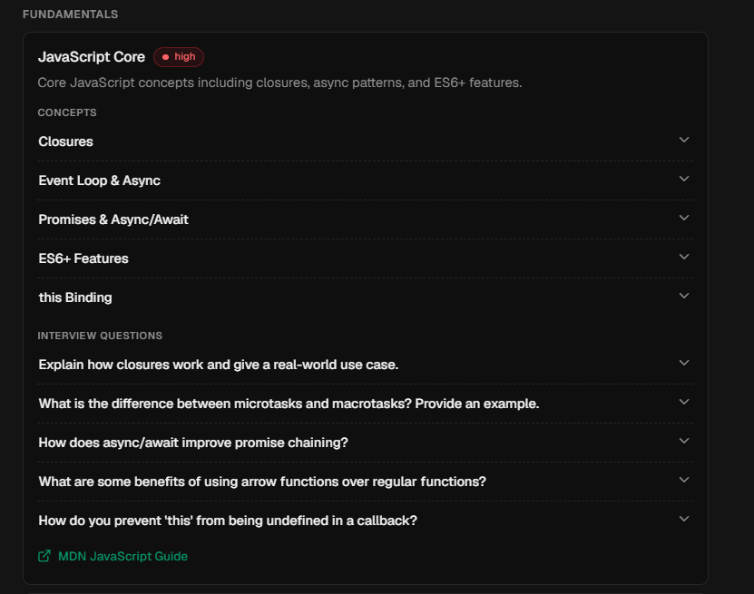
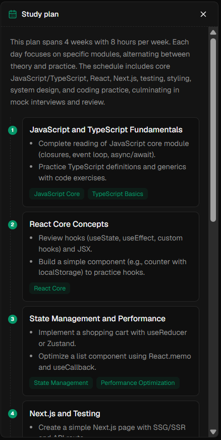
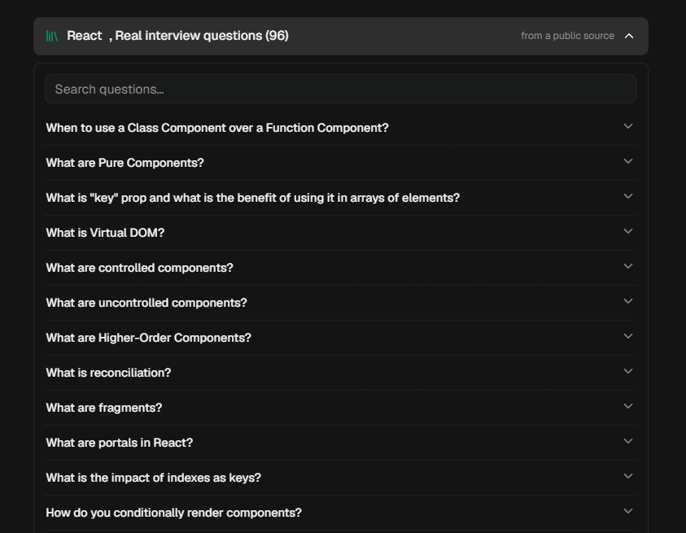
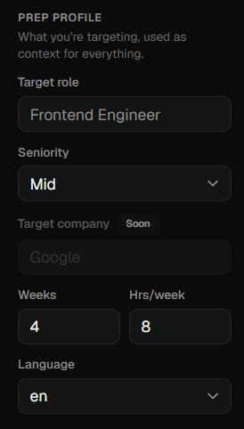

<div align="center">

<h1>🎯 Interviews Agent</h1>

**Describe the role and stack you're interviewing for, and get a personalized interview-prep
roadmap** — the exact topics to master, with concepts and real interview questions, grounded in
official documentation.

<br />

[](https://github.com/alvajose/interviews-agent/actions/workflows/ci.yml)
[](LICENSE)
[](https://nextjs.org)
[](https://www.typescriptlang.org)
[](https://www.sqlite.org)

<h3>

▶ [Try the live demo](https://interviewsagent.carinaex.com) &nbsp;·&nbsp; [Run it locally](#-quick-start-local) in two minutes &nbsp;·&nbsp; [Contribute](#-contributing)

</h3>


</div>

<br />

> Interviews Agent runs **fully local** out of the box — SQLite, no login, bring your own LLM
> key. The same codebase powers the hosted product (accounts + credits) when you configure it.
> It's grounded in official docs and the
> [Tech Interview Handbook](https://www.techinterviewhandbook.org/).

## 🤔 Why not just ask ChatGPT, Claude, or Gemini?

You can — and for a one-off question you should. But a raw chatbot gives you a fresh,
unstructured answer every time, and will happily invent plausible-sounding interview
questions. Interviews Agent is opinionated on purpose:

- **Grounded, not guessed** — questions and concepts are curated and cited to official docs
  and the [Tech Interview Handbook](https://www.techinterviewhandbook.org/), not improvised token-by-token.
- **A plan, not a chat log** — you get a prioritized roadmap and a day-by-day schedule sized to
  your weeks and hours, that persists and evolves, instead of scrolling back through a thread.
- **Consistent and complete** — the same stack always covers the same ground; a chatbot forgets
  what it already told you and skips topics between sessions.
- **Yours and private** — runs fully local on SQLite with your own key. No account, no data leaving your machine.

It still *uses* an LLM under the hood — it just puts curated content, structure, and memory around it.

## ✨ What you get

- 🗺️ **A personalized roadmap in under a minute** — modules grouped by priority, sized to your weeks and hours.
- 📚 **Real interview questions** — curated per stack and grounded in official documentation, not LLM trivia.
- 🧠 **Concepts that teach** — each module explains the *why* and the mental model, with cited sources.
- 📅 **A day-by-day study plan** — phased tasks linked back to the exact modules to review.
- 💬 **Coaching follow-ups** — ask questions and reshape the plan in a chat.
- 🔒 **Local-first & private** — your conversations live in a local SQLite file; no account required.

## 🖼️ Screenshots

<table>
  <tr>
    <td align="center" width="50%"><br/><sub>Concepts + real interview questions, grounded in docs</sub></td>
    <td align="center" width="50%"><br/><sub>A day-by-day study plan, sized to you</sub></td>
  </tr>
  <tr>
    <td align="center" width="50%"><br/><sub>Curated question banks from public sources</sub></td>
    <td align="center" width="50%"><br/><sub>Set your target role, seniority, and pace</sub></td>
  </tr>
</table>

## Try it

- **Fastest:** open the [free live demo](https://interviewsagent.carinaex.com) — no install, no sign-up
  to look around.
- **On your machine:** the [local quick start](#-quick-start-local) below runs the whole app with
  just an LLM key.

## 🚀 Quick start (local)

Runs entirely on your machine with SQLite, no login, no database service, no payments.
The only thing you need is an LLM API key.

**Prerequisites:** Node.js 24+ and pnpm (`corepack enable` picks the pinned version).

```bash
git clone https://github.com/alvajose/interviews-agent.git
cd interviews-agent
pnpm install
cp .env.example .env.local
```

Edit `.env.local` so it contains just these two lines (the rest is only for hosted mode):

```env
NEXT_PUBLIC_APP_MODE=local
GEMINI_API_KEY=your_gemini_key      # free key at https://aistudio.google.com/apikey
```

Prefer a different model? Instead of the Gemini key, point it at any OpenAI-style
chat-completions endpoint (OpenCode Go, DeepSeek, OpenRouter, a local model…):

```env
NEXT_PUBLIC_APP_MODE=local
LLM_PROVIDER=compatible
LLM_API_KEY=your_key
LLM_BASE_URL=https://your-provider/v1
LLM_MODEL=your_model
# If the gateway 400s about response_format, add: LLM_JSON_MODE=false
```

Then start it:

```bash
pnpm dev
```

Open **http://localhost:3000**, no sign-up, straight into the chat. Your conversations are
saved to a local SQLite file at `./data/local.db` (gitignored). That's it.

### `pnpm dev:local` — force local mode

If your `.env.local` is set up for hosted (it has `NEXT_PUBLIC_SUPABASE_URL`), the app
defaults to hosted and you'd land on the marketing page instead of the chat. Rather than
editing that file, just run:

```bash
pnpm dev:local
```

It forces `NEXT_PUBLIC_APP_MODE=local` for that run only, your `.env.local` is left
untouched. Flags pass through (`pnpm dev:local --port 4000`), and you can do a
production-style local run with `pnpm dev:local build` then `pnpm dev:local start`.

## ⚙️ How mode selection works

`src/lib/mode.ts` resolves the runtime mode once:

- `NEXT_PUBLIC_APP_MODE=local` or `=hosted` wins if set (this is what `dev:local` forces).
- Otherwise, a configured `NEXT_PUBLIC_SUPABASE_URL` means **hosted**; a bare clone with
  neither means **local**.

What changes per mode:

| | **Local** | **Hosted** |
|---|---|---|
| Entry point (`/`) | The chat, directly | Marketing landing |
| Auth | None (single implicit user) | Supabase accounts + `/login` |
| Persistence | SQLite (`./data/local.db`) | Supabase Postgres |
| Billing / credits | Off | Stripe credits |
| Terms / Privacy / Refund | Hidden | Shown |

Local mode never links to login, credits, or billing, those pages still exist in the
codebase (hosted needs them) but are simply never shown.

## ☁️ Hosted mode (optional)

To run the full product, Supabase accounts, credits, and abuse defense, set
`NEXT_PUBLIC_APP_MODE=hosted` (or just provide the Supabase env vars) and fill in the rest of
`.env.example`. Boot validation in `src/lib/env.ts` fails fast and lists any missing required
variable. You only need this to deploy the paid, multi-user version.

## 📖 Knowledge base status

We're actively expanding the interview knowledge base, more stacks, deeper modules, and
better-sourced question banks. Coverage is incomplete on purpose: treat what's here as a
solid starting point, and PRs that add or sharpen content are especially welcome.

## 🤝 Contributing

Contributions are very welcome, **especially to the agent's knowledge base and its docs.**

The project's real value is well-sourced, study-worthy interview content, so **any improvement
to the documentation the agent teaches from is genuinely appreciated**: adding a tech stack,
sharpening a concept, fixing an example, or clarifying a guide.

- **Add or improve interview content** → [docs/adding-content.md](docs/adding-content.md)
- **Setup, checks, and code style** → [CONTRIBUTING.md](CONTRIBUTING.md)

Open an issue to discuss anything larger, or send a PR for small fixes. Every doc improvement
helps someone prep better. PRs merge to `main` only after maintainer review.

## ✅ Checks

```bash
pnpm lint            # eslint
pnpm typecheck       # tsc --noEmit
pnpm test            # unit tests (Vitest)
pnpm test:coverage   # unit tests + coverage thresholds
pnpm check           # content-freshness report (informational)
pnpm test:e2e        # Playwright end-to-end
```

CI (`.github/workflows/ci.yml`) runs lint, typecheck, tests with coverage, and a build on
every push to `main` and every PR.

## 🗂️ Project layout

```
src/
  app/
    api/            # chat, roadmap, profile, bank, stripe/*, credits, account, landing
    (routes)        # /app, /login, /profile, /admin, /credits, /terms, /privacy
  lib/
    env.ts          # boot-time env validation (tiered: CORE / prod / recommended)
    mode.ts         # local vs hosted runtime switch
    llm.ts          # provider wrapper (gemini | openai-compatible), no SDKs
    store/          # conversation persistence (SQLite local / Supabase hosted)
    prompts.ts      # prompt builders
  proxy.ts          # session + legal-consent gate (Next 16 replaces middleware.ts)
content/            # curated interview modules + question banks (see docs/adding-content.md)
supabase/migrations # Postgres schema for hosted mode
```

## 📝 Notes

- **Persistence:** local mode stores conversations in SQLite (`./data/local.db`); hosted mode
  uses Supabase Postgres (schema in `supabase/migrations`).
- No RAG/embeddings yet, the content taxonomy is static. Add pgvector only if keyword/structural
  matching falls short.

## 📄 License

[MIT](LICENSE). Free to use, copy, modify, merge, publish, distribute, sublicense, and/or sell.

<div align="center">
<sub>Built by <a href="https://github.com/alvajose">alvajose</a> · powered by <a href="https://www.techinterviewhandbook.org/">Tech Interview Handbook</a> and official docs</sub>
</div>
